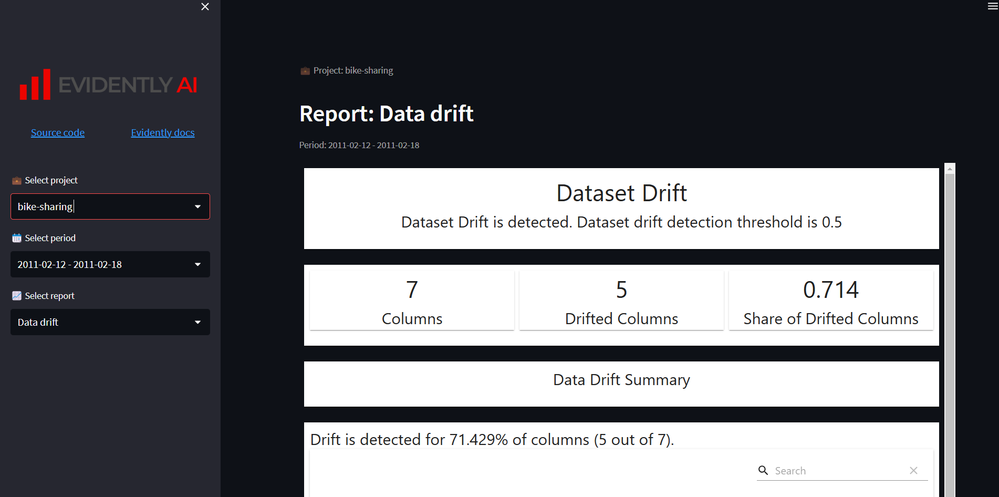

# 🚀 Docker Experiment 7: 🧠 ML Model with Evidently - Dockerized Streamlit App

This project demonstrates how to **Dockerize a Streamlit application** that integrates an **ML model** with **Evidently AI** for monitoring and visualization. It ensures smooth, containerized deployment of the application.

---

## 📁 Project Structure

```plaintext
Docker_Practices/
├── app/             # Streamlit app source files
├── projects/        # ML model and related files
├── requirements.txt # Python dependencies
├── Dockerfile       # Dockerfile to build the image
└── app.py           # Main entry point for Streamlit app
```

---

## 🛠️ Setup Instructions

### 🔹 Step 1: Clone the Repository

```bash
git clone https://github.com/BhavyaDhimxn/container-experiments.git
cd Docker_Practices
```

---

### 🔹 Step 2: Build and Run the Docker Container

#### 🛠 Build the Docker Image

```bash
docker build -t streamlit-ml-app .
```

#### 🚀 Run the Container

```bash
docker run -p 8501:8501 streamlit-ml-app
```

---

## 📊 Usage

Once the container is running, open your browser and navigate to:

[http://localhost:8501](http://localhost:8501)

You will see the **Streamlit ML Dashboard** powered by **Evidently**.

---

## 📸 Result

Below is a snapshot of the running dashboard:



---

## ⭐ Additional Info

- The application combines **ML model insights** with **Evidently AI's monitoring tools**.
- Fully portable and reproducible via Docker.

---

